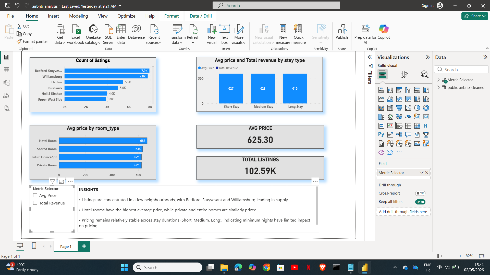

\# Airbnb Data Analysis

\## Objective

Analyze Airbnb dataset to understand pricing trends, availability, and key pricing trend, availability, and key factors affecting listing prices.

\## Tools Used

\-SQL(PostgreSQL)

\-Power BI

\## Project Structure

\-'data/' - Dataset files

\-'sql/' - SQL queries (cleaning + analysis)

\-'powerbi/' - Dashboard file

\-'screenshots/' - Output visuals

\## Key Analysis

\-Average price by neighbourhood

\-Availability trends across listings

\-Identification of outliers in pricing

\-Relationship between room type and price

\## Sample SQL Query

'''sql

\--- Business Question: Which neigbourhoods have highest average price

SELECT neighbourhood, AVG(price) AS

avg\_price

FROM airbnb\_data

GROUP BY neighbourhood

ORDER BY avg\_price DESC;

\## Project Overview

This project analyses Airbnb listings data to uncover pricing patterns, availability trends, and key factors influencing listing

prices. The goal is to derive business insights that can help hosts optimize pricing and improve occupancy.

\## Dashboard Preview

&#x20;

